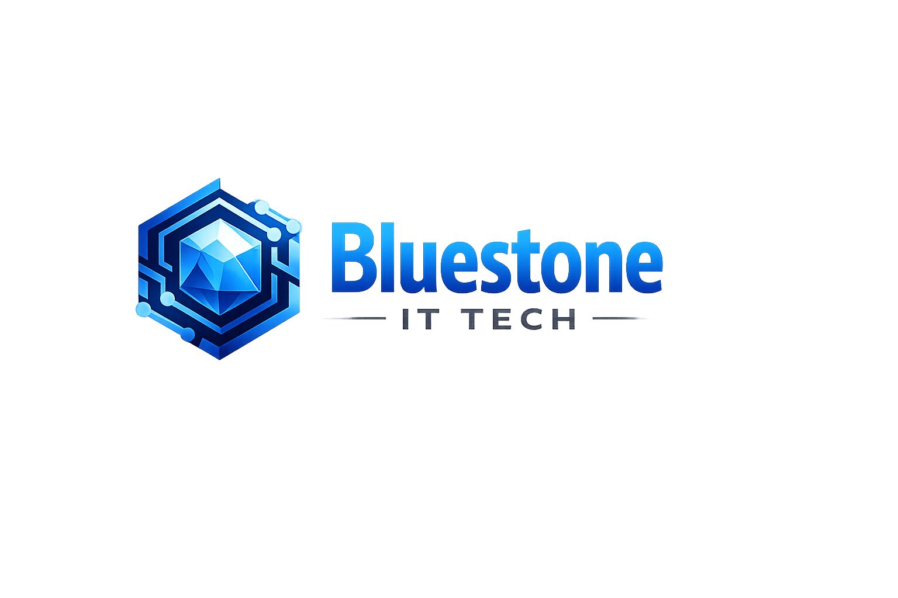

# Bluestone IT Tech LLC - Professional Website



## 🚀 About

Bluestone IT Tech LLC is a leading IT staffing and consulting company specializing in end-to-end IT solutions. Our modern, fully responsive website showcases our comprehensive services including SAP, Cloud & DevOps, Data Engineering, Application Development, and IT Staffing solutions. Built with React, TypeScript, and Bootstrap for optimal performance and user experience.

## ✨ Features

### 🎨 Design & UI/UX
- **Modern Corporate Design**: Clean, professional interface with Navy Blue and Tech Blue branding
- **Fully Responsive**: Optimized for desktop, tablet, and mobile devices
- **Accessibility**: Built with accessibility best practices (ARIA labels, keyboard navigation)
- **Smooth Animations**: AOS-powered scroll animations for engaging user experience
- **Brand Consistency**: Adheres to corporate brand guidelines

### 🔧 Technical Features
- **TypeScript**: Fully typed for better development experience and maintainability
- **React Router**: Client-side routing with proper navigation and dynamic meta tags
- **Bootstrap Integration**: Responsive grid system and components
- **Custom Meta Tags Hook**: Dynamic SEO optimization with custom useMetaTags hook
- **Performance Optimized**: Lazy loading, optimized images, and efficient bundling
- **SEO Optimized**: Dynamic meta tags, structured data, and semantic HTML

### 📱 User Experience
- **Smooth Scrolling**: Enhanced navigation experience
- **Back to Top Button**: Easy navigation for long pages
- **Interactive Elements**: Hover effects and micro-interactions
- **Contact Form**: Fully functional contact form with validation
- **Dynamic Page Titles**: Instant title updates when navigating between pages

### 🛡️ Professional Features
- **Multi-Page Structure**: Comprehensive site with Home, About, Services, Staffing, Vendors, Bench Sales, Careers, and Contact
- **Google Maps Integration**: Interactive location display for headquarters
- **Email Integration**: Clickable email links with reusable EmailLink component
- **Social Media Ready**: Prepared for LinkedIn and other social integrations
- **Print Styles**: Optimized for printing professional documents

## 🏗️ Project Structure

```
BluestoneIT/
├── public/
│   ├── Bluestone.jpeg          # Company logo
│   └── vite.svg
├── src/
│   ├── components/
│   │   ├── Navbar.tsx          # Navigation component
│   │   ├── Footer.tsx          # Footer with contact info and social links
│   │   ├── BackToTop.tsx       # Scroll to top button
│   │   └── EmailLink.tsx       # Reusable email component
│   ├── hooks/
│   │   └── useMetaTags.ts      # Custom hook for dynamic meta tags
│   ├── pages/
│   │   ├── Home.tsx            # Landing page with hero section
│   │   ├── About.tsx           # Company information and values
│   │   ├── Services.tsx        # Comprehensive services overview
│   │   ├── Staffing.tsx        # IT staffing and talent solutions
│   │   ├── Vendors.tsx         # Vendor partnership information
│   │   ├── BenchSales.tsx      # Bench sales and candidate marketing
│   │   ├── Careers.tsx         # Career opportunities and application
│   │   ├── Contact.tsx         # Contact form and office information
│   │   ├── PrivacyPolicy.tsx   # Privacy policy page
│   │   ├── TermsConditions.tsx # Terms and conditions page
│   │   └── NotFound.tsx        # 404 error page
│   ├── App.tsx                 # Main application component
│   ├── App.css                 # Main stylesheet with brand colors
│   ├── index.css               # Global styles
│   └── main.tsx                # Application entry point
├── index.html                  # HTML template
├── package.json                # Dependencies and scripts
├── tsconfig.json               # TypeScript configuration
├── vite.config.ts              # Vite configuration
└── README.md                   # Project documentation
```
│   ├── pages/
│   │   ├── Home.tsx        # Landing page
│   │   ├── About.tsx       # Company information
│   │   ├── Contact.tsx     # Contact form & info
│   │   └── NotFound.tsx    # 404 error page
│   ├── App.tsx            # Main application component
│   ├── App.css           # Main stylesheet
│   ├── index.css         # Global styles
│   └── main.tsx          # Application entry point
├── index.html            # HTML template
├── package.json          # Dependencies and scripts
├── tsconfig.json         # TypeScript configuration
├── vite.config.ts        # Vite configuration
└── README.md            # Project documentation
```

## 🚀 Getting Started

### Prerequisites
- Node.js (v16 or higher)
- npm or yarn

### Installation

1. **Clone the repository**
   ```bash
   git clone <repository-url>
   cd BluestoneIT
   ```

2. **Install dependencies**
   ```bash
   npm install
   ```

3. **Start development server**
   ```bash
   npm run dev
   ```

4. **Open in browser**
   Navigate to `http://localhost:5173`

### Build for Production

```bash
# Build the application
npm run build

# Preview the production build
npm run preview
```

## 🛠️ Technologies Used

### Core Technologies
- **React 19.2.0** - Modern React with latest features and concurrent rendering
- **TypeScript** - Type-safe development with comprehensive interfaces
- **Vite** - Fast build tool and development server with HMR

### UI & Styling
- **Bootstrap 5.3.8** - Responsive CSS framework with utilities
- **React Bootstrap 2.10.10** - Bootstrap components for React
- **AOS (Animate On Scroll) 2.3.4** - Scroll-triggered animations
- **React Icons 5.5.0** - Comprehensive icon library (FontAwesome, etc.)

### Routing & Navigation
- **React Router DOM 7.13.0** - Client-side routing with data APIs
- **Custom Meta Tags Hook** - Dynamic SEO optimization without external dependencies

### Development Tools
- **ESLint 9.39.1** - Code linting with React and TypeScript rules
- **TypeScript ESLint** - TypeScript-specific linting rules
- **Vite React Plugin** - React support and fast refresh

### Key Dependencies
- **React DOM 19.2.5** - React rendering for web
- **React Router Types** - TypeScript support for React Router

## 🎯 Key Pages & Features

### 🏠 Home Page
- **Hero Section**: End-to-end IT solutions headline with primary/secondary CTAs
- **Trust Bar**: Experienced consultants, enterprise solutions, delivery model highlights
- **About Snapshot**: Company overview with mission, vision, and "Learn More" button
- **Services Overview**: IT Consulting, SAP, Cloud & DevOps, Data Engineering, Application Development
- **Industries Served**: Healthcare, Retail, Banking, Hi-Tech, Manufacturing
- **Why Choose Us**: Skilled professionals, proven model, scalable engagements, quality & compliance
- **Call to Action**: "Let's Build the Right Technology" with contact button

### ℹ️ About Page
- **Company Overview**: Bluestone IT Tech LLC introduction and commitment
- **Core Values**: Integrity, Innovation, Excellence, Collaboration
- **Mission & Vision**: Clear business objectives and long-term goals
- **Professional Narrative**: Technology consulting firm focus

### 🛠️ Services Page
- **IT Consulting & Strategy**: Digital transformation and enterprise architecture
- **IT Staffing & Talent Solutions**: Offshore and onsite candidate delivery
- **SAP Services**: MM, SD, WM, SuccessFactors implementation and support
- **Cloud & DevOps**: AWS, Azure, Kubernetes, CI/CD automation
- **Data Engineering & Analytics**: Data pipelines, analytics, and BI solutions
- **Application Development**: Custom web and enterprise applications

### 👥 Staffing Page
- **IT Staffing Capabilities**: End-to-end staffing solutions
- **Roles Supported**: SAP, Cloud & DevOps, Data Engineers, AI/ML, Azure, Dynamics 365, Full Stack, QA Engineers
- **Client & Vendor Engagement**: Transparent partnership models
- **Delivery Process**: Requirement intake, sourcing, screening, submission, onboarding
- **Value Proposition**: Faster closures, reduced risk, scalable delivery

### 🤝 Vendors Page
- **Partner Collaboration**: Work with prime vendors and implementation partners
- **Vendor-Friendly Terms**: NDA/MSA ready, compliance-focused
- **Technology Focus**: SAP, Cloud & DevOps, Data & AI, Application Development, QA & Automation
- **Contact Information**: Dedicated vendor email and partnership details

### 📊 Bench Sales Page
- **Bench Sales Overview**: Pre-screened consultants for immediate deployment
- **Bench Strength**: SAP, Cloud, Data, DevOps, Full Stack availability
- **Sales Process**: Requirement analysis, resume marketing, submissions, support
- **Vendor Benefits**: Transparent ownership, fast response, quality representation

### 💼 Careers Page
- **Join Our Team**: Growth-oriented culture and challenging projects
- **Benefits**: Competitive compensation and global exposure
- **Application Process**: Resume submission via dedicated email
- **Professional Development**: Career advancement opportunities

### 📞 Contact Page
- **Contact Form**: Name, email, phone, subject, message fields with validation
- **Office Information**: Headquarters address in Maple Valley, Washington
- **Business Hours**: Monday-Friday 9AM-6PM, Saturday 10AM-4PM
- **Interactive Map**: Google Maps integration with exact coordinates
- **Direct Contact**: Phone and email information

## 🎨 Brand Guidelines Implementation

### Color Scheme
Following the official brand guidelines:
```css
:root {
  --primary-color: #003366;    /* Navy Blue */
  --secondary-color: #2563eb;  /* Tech Blue */
  --accent-color: #06b6d4;     /* Cyan */
  --dark-color: #1e293b;
  --light-color: #f1f5f9;      /* Light Gray */
  --text-color: #334155;
  --text-light: #64748b;
  --success-color: #10b981;
  --warning-color: #f59e0b;
  --danger-color: #ef4444;
  --border-color: #e2e8f0;
}
```

### Typography
- **Primary Font**: Poppins (headers and branding)
- **Secondary Font**: Inter (body text and UI elements)
- **Style**: Clean, corporate, minimal design approach

### Visual Elements
- **Logo**: Bluestone IT Tech LLC branding
- **Icons**: Consistent React Icons throughout
- **Layout**: Professional grid-based responsive design
- **Animations**: Subtle AOS animations for engagement

## 🔧 Customization

### Adding New Pages
1. Create component in `src/pages/` with proper TypeScript typing
2. Add route in `App.tsx` with exact path matching
3. Update navigation in `Navbar.tsx` and `Footer.tsx`
4. Implement `useMetaTags` hook for SEO optimization
5. Follow brand guidelines for styling and content

### Meta Tags Implementation
Each page uses the custom `useMetaTags` hook for dynamic SEO:

```tsx
import { useMetaTags } from '../hooks/useMetaTags';

const MyPage = () => {
  useMetaTags({
    title: 'Page Title | Bluestone IT Tech LLC',
    description: 'Page description for SEO',
    keywords: 'relevant, keywords, here'
  });

  return (
    // Page content
  );
};
```

### Email Integration
Use the reusable `EmailLink` component for consistent email handling:

```tsx
import EmailLink from '../components/EmailLink';

// In JSX
<EmailLink email="contact@bluestoneittech.com" />
```

## 📱 Mobile Responsiveness

The website is fully responsive with Bootstrap breakpoints:
- **Desktop**: 1200px+ (xl)
- **Laptop**: 992px - 1199px (lg)
- **Tablet**: 768px - 991px (md)
- **Mobile**: Below 768px (sm)

All components adapt seamlessly across devices with proper touch interactions and optimized layouts.

## 🚀 SEO & Performance

### Dynamic Meta Tags
- **Custom Hook**: `useMetaTags` for immediate title and meta updates
- **Page-Specific Content**: Each page has unique title, description, and keywords
- **Social Media Ready**: Open Graph and Twitter Card support
- **Clean URLs**: SEO-friendly routing structure

### Performance Optimizations
- **Vite Build**: Fast development and optimized production builds
- **Lazy Loading**: Components load as needed
- **Optimized Images**: Proper sizing and formats
- **Minimal Bundle**: Tree-shaking and code splitting

## 🔗 Integration Features

### Contact & Communication
- **Headquarters**: 29010 239th Ave SE, Maple Valley, Washington 98010, US
- **Map Coordinates**: 47.373348, -122.036926 for Google Maps
- **Business Email**: info@bluestoneittech.com
- **Vendor Email**: vendors@bluestoneittech.com
- **Careers Email**: careers@bluestoneittech.com

### Social Media
- **LinkedIn**: https://www.linkedin.com/company/blue-stone-it/posts/?feedView=all
- **Ready for Integration**: Prepared for additional social platforms

## 🚀 Deployment

### Build for Production
```bash
npm run build
```

The built files will be in the `dist/` directory, ready for deployment to:
- **Static Hosting**: Netlify, Vercel, GitHub Pages
- **CDN**: AWS S3 + CloudFront, Google Cloud Storage
- **Traditional Hosting**: Any web server supporting static files

### Environment Setup
```bash
# Install dependencies
npm install

# Development server
npm run dev

# Production build
npm run build

# Preview production build
npm run preview
```

## 📄 License & Support

### License
This project is licensed under the MIT License - see the LICENSE file for details.

### Support
For technical support or business inquiries:
- **Email**: info@bluestoneittech.com
- **Location**: Maple Valley, Washington, USA
- **Business Hours**: Monday-Friday 9:00 AM - 6:00 PM PST

### Contributing
1. Fork the repository
2. Create a feature branch
3. Make changes following TypeScript and ESLint standards
4. Test thoroughly across devices
5. Submit a pull request

---

**Built with ❤️ by the Bluestone IT Tech LLC Development Team**

*Empowering businesses with reliable, scalable, and future-ready technology solutions*